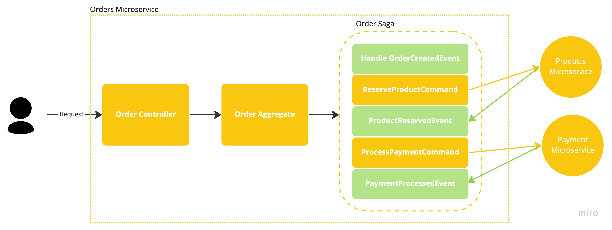

## Order Service

### Running the application locally
#### Requirements
- Java 11 - due to incompatibilities with Axon framework on greater versions.
- Maven*
That is a SpringBoot application build on Kotlin that you can run it locally with maven as it is and will be using port 8080
- Run `mvn clean install` in order to install all dependencies
- Run `mvn run` to launch the application

*Note: I usually run it using IntelliJ, so maven is run from there, if you run it from console you might need to install maven too 

### Running the application as standalone docker
#### Requirements
- Docker

#### Build the application:
- Go to `/OrderService/` path
- Run the next command
```bash
docker build -t orderms .
```
####


#### Run the application:
- Go to `/OrderService/` path
- Run the next command
```bash
docker run --rm -it orderms:latest
```
####

Service Description (WIP)



