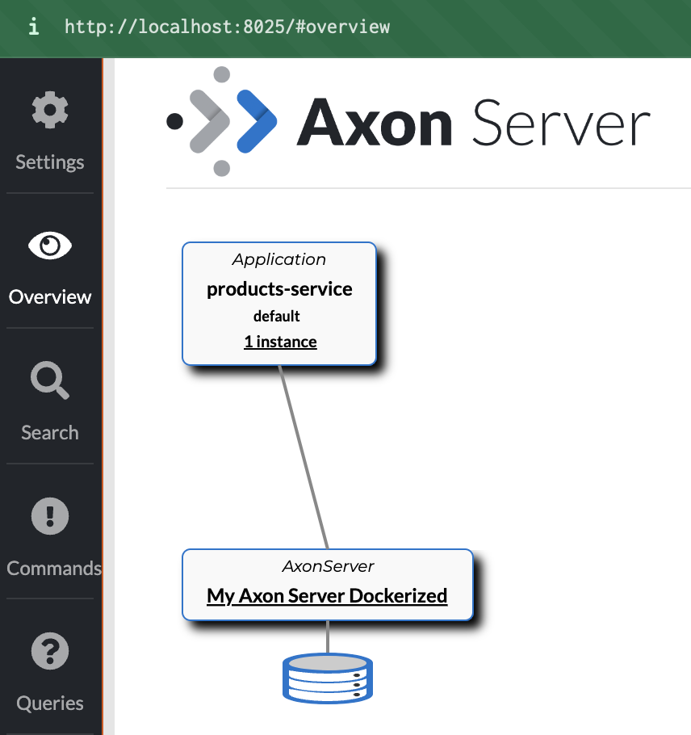

# Event Based Microservices development stack

This development stack is based on  Spring Boot, Spring Cloud and Axon

Includes the following services:

- Spring Cloud Api Gateway
- Service Discovery Server ([SpringCloud Eureka Server](https://cloud.spring.io/spring-cloud-netflix/reference/html/#spring-cloud-eureka-server))
- [Axon Server](https://developer.axoniq.io/axon-server/technical-highlights) for Queue & Event Management 
- Kotlin Microservices with [Spring Boot](http://projects.spring.io/spring-boot/) and Command & Query responsibility Separation with [Axon CQRS Framework](http://www.axonframework.org/)

## Requirements
- Java 11
- Docker & Docker Compose

## Starting the stack

- Start Axon Server:
  - Go to console /projectPath/docker-data/AxonServer
  - Run ``docker-compose up -d``
  - This will start the server on http://localhost:8025/

- Start Discovery Service:
  - Go to /projectPath/DiscoveryService
  - Run the Kotlin Microservice on it with your favourite maven/kotlin compiler
  - This will start the discovery service based on [SpringCloud Eureka Server](https://cloud.spring.io/spring-cloud-netflix/reference/html/#spring-cloud-eureka-server) on http://localhost:8761/

- Start Api Gateway:
  - Go to /projectPath/ApiGateway
  - Run the Kotlin Microservice on it with your favourite java/maven compiler
  - This will start the ApiGateway service based on [Spring Cloud Api Gateway](https://cloud.spring.io/spring-cloud-gateway/reference/html/) on http://localhost:8082/

- Start the Product Service:
  - Go to /projectPath/ProductService
  - Run the Kotlin Microservice on it with your favourite maven/kotlin compiler
  - This will start the ProductService on a specific port (that changes every time by configuration) and will register to the Discovery client and make it available through the Api Gateway through the next route.
  - If everything went well the next things should happen:
    - The Product service should appear linked to axon Server (http://localhost:8025/) on Overview tab:

      
    - The Product service and the Api Gateway should appear on to the Discovery Service view as registered to it (http://localhost:8761/):

        
  
    - You should be able to access the Product service through the Api Gateway through the next route:
      - Go to http://localhost:8082/products-service/products (It might need some time to be available)
      - Go to http://localhost:8082/products-service/h2 (To access the H2 database used for the projections)

